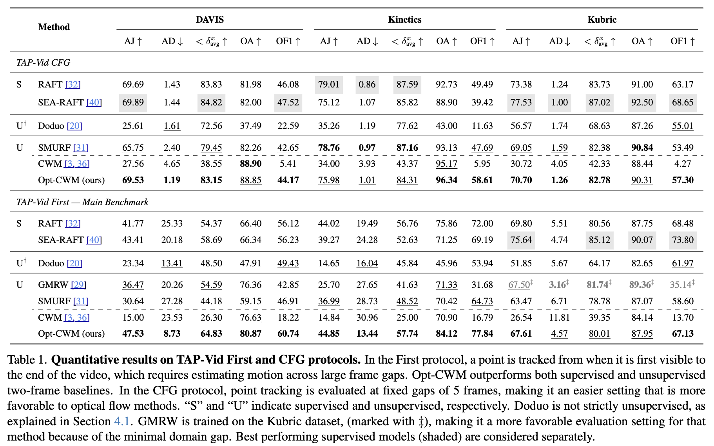

<div align="center">
<h2>Self-Supervised Learning of Motion Concepts by Optimizing Counterfactuals</h2>

[**Stefan Stojanov***](https://sstojanov.github.io/)<sup>1</sup> · [**David Wendt***](https://www.linkedin.com/in/~davidwendt/)<sup>1</sup> · [**Seungwoo Kim***](https://www.linkedin.com/in/seungwoo-simon-kim/)<sup>1</sup> · [**Rahul Venkatesh***](https://rahulvenkk.github.io/)<sup>1</sup>

[**Kevin Feigelis**](https://www.linkedin.com/in/kevin-feigelis/)<sup>1</sup> · [**Jiajun Wu**](https://jiajunwu.com/)<sup>1</sup>  · [**Daniel L. K. Yamins**](https://web.stanford.edu/~yamins/)<sup>1</sup> 

<sup>1</sup>Stanford

(* equal contribution)

<a href="https://en.wikipedia.org/wiki/HTTP_404"></a>
<a href='https://neuroailab.github.io/opt_cwm_page/'></a>
<a href='https://colab.research.google.com/drive/1ghkpW78ZQmdHURB-pDtGudrLOnzcBxTD?usp=sharing'></a>
</div>

This work presents Opt-CWM, an unsupervised model for optical flow prediction. Opt-CWM builds on the Counterfactual World Modeling (CWM) paradigm, achieving state-of-the-art performance on the TAP-Vid benchmark.


## 🔨 Installation
```
conda create -n optcwm python=3.10
conda activate optcwm
git clone https://github.com/neuroailab/Opt-CWM.git
pip install -e .
```

## 🔧 Configs
We provide sample YAML files in `configs/` that show the configurations used for training and evaluation. Specific model input parameters are frozen to default (train-time checkpointed) configurations, which can be found in `models/builder.py`. 
This can be modified dynamically through YAML, e.g. 
```yaml 
# configs/eval_configs.yaml
model_args: 
  flow_predictor:
    zoom_iters: 4
    masking_iters: 10
...
```
will pass the configured `zoom_iters` and `masking_iters` to the `FlowPredictor` class. Equivalently, configurations can be set through CLI, e.g.
```bash
python demo.py \
 --yaml=configs/eval_configs.yaml \
 --model_args.flow_predictor.zoom_iters=4
```

## ✨ Usage
To use the pretrained FlowPredictor, run the following: 
```python
from model import builder

model_args = ... # get model args from YAML or CLI

model = builder.get_flow_predictor(model_args)
model.load_pretrained(highres=True, force=False)
```
This will initialize the flow predictor with the appropriate configs (which can be overwritten as described above) and automatically download the checkpoint to `$CACHE`. 

Similarly, to load the full pretrained Opt-CWM model ($\Psi^{\texttt{flow}}$ in paper), 
```python
from model import builder

model_args = ... # get model args from YAML or CLI

model = builder.get_opt_cwm(model_args)
model.load_pretrained(force=False)
```
An example of the model interface can be found here: [](https://colab.research.google.com/drive/1ghkpW78ZQmdHURB-pDtGudrLOnzcBxTD?usp=sharing). 

### Running the Flow Predictor
To demo the trained model on a sample frame pair, run
```bash 
./scripts/run_demo.sh
```
Refer to `demo.py` for an example of using the pre-trained FlowPredictor on sample images.

## 📀 Data

To use configs and convenience scripts out of the box, we recommend downloading the directory and organizing it in the following way: 
```bash 
|-models 
|-data 
|-datasets
|   ├── tapvid
|   |    ├── tapvid_kinetics_sampled.pkl
|   |    ├── tapvid_davis.pkl
|   ├── kinetics
|   |    ├── kinetics400_training_list.txt
...
```
### TAP-Vid Evaluation
The Opt-CWM Flow Predictor is evaluated on the TAP-Vid benchmark. For evaluation efficiency, we sample 30 videos (the same size as DAVIS) from the Kinetics subset. Both pickle files are available to download through the following script.
```bash 
python data/tapvid/download_tapvid_data.py --save_dir datasets/tapvid # --dataset {all | davis | kinetics}
```

### Pre-training
Opt-CWM is pre-trained on Kinetics-400 video dataset. For more efficient data loading, we preprocess each video by chunking them into 10-second segments. 

### Prepare dataset
Our pre-processed Kinetics-400 dataset can be downloaded by running the following command in the root directory. The downloaded dataset takes about 470G.
```
python data/kinetics/download_kinetics_data.py --save-path /path/to/kinetics/data
```
Once the data is successfully downloaded, we provide a script that generates a text file, which contains a list of video filenames in the folder specified by `--videos_path`. This script saves the text file to the destination specified by `--output_path`.

```
python data/kinetics/prepare_video_file_list.py --videos_path /path/to/kinetics/data --output_path data/kinetics/video_file_lists/kinetics400_training_list.txt
```

If the commands above execute successfully, a text file containing a list of video paths for training will be saved to `data/kinetics/video_file_lists/kinetics400_training_list.txt`

## 🧪 Evaluation
Ensure that the TAP-Vid dataset is correctly downloaded. The evaluations reported in the paper can be run by
 
```bash
./scripts/run_tapvid_eval.sh [DATASET] [EVALUATION] 

# e.g. ./run_eval.sh davis first
```
For reference, evaluation results from the paper are attached below: 


We observe that our method (Opt-CWM) achieves state-of-the-art results against existing supervised and self-supervised baselines. In particular, it is particularly robust against variable and large frame gaps, which is explicitly tested by TAP-Vid First.


## 🔄 Pre-training
Opt-CWM is pre-trained on Kinetics-400 video dataset. To run training, run
```bash
./scripts/run_train.sh
```

## ⚡ Distillation
We also provide a self-supervised distilled model for further computational efficiency. The distilled model uses the SEA-RAFT architecture, and is trained on pseudo-labeled flow from the Opt-CWM model. The final result is comparable to SOTA supervised flow methods, e.g. RAFT, on the TAP-Vid benchmarks.

To download and run the distilled model, run the following
```bash
NPROC=1 ./scripts/run_raft.sh [DATASET] [EVALUATION] 
```

## Citation

If you find this project useful, please consider citing:

```bibtex
@article{TBD}
```